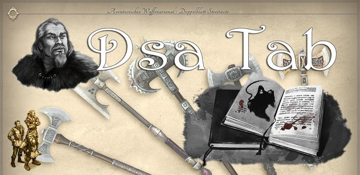
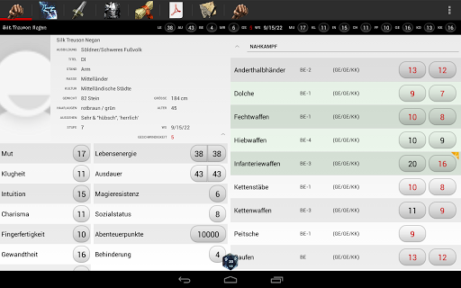

DsaTab
======

An android app to handle your [DSA][2] Pen&amp;Paper roleplaying characters.
DsaTab requires Android 2.2 and is compatible with the newest version of [Helden-Software][1] 5.2.6

Get the current version (only in german) from the [google play store][3], old release can be found in the [releases](https://github.com/gandulf/DsaTab/tree/master/Releases) folder:

Screenshot showing the first character and talents tab, for more images goto the google play store:

## How to use DsaTab

DsaTab builds upon the software [Helden-Software][1] and enables you to take your character with you on your android smartphone or tablet.

* Create your character using Helden-Software
* Export your hero as a xml file
* Start DsaTab on smartphone to see where the dsatab folder is created (settings).
* Copy the xml file to your smartphone/tablet into the SD-CARD/dsatab folder. You could also use dropbox or another synchonization tool to sync the files to your smartphone and change the path to the folder in the dsatab settings.
* Start DsaTab again and load your character.
* Don't forget to save the character to keep changes made in DsaTab for the next session.

## Development

To deploy this app you need the following Libraries in your Eclipse workspace:

* [ActionBarSherlock][4] 
  You need at least version 4.2.0+.
	Extract the directory library from the downloaded file and create a android library project named ActionBarSherlock with it.

* [GuiLib][5] (Combination of the following libraries below) 
	Create a library project named GuiLib. These library includes the following projects:
	* [Drag Sort list][6]
	* [PhotoView][7]	
	* [ShowcaseView][8]	
	* [Draggable GridView][9]
	* [GridViewCompat][10]
	
* GridLayout v7 support library from google sdk 	
	Can be downloaded from google using sdk manager

## License

    Copyright 2012 Gandulf Kohlweiss

    Licensed under the Apache License, Version 2.0 (the "License");
    you may not use this file except in compliance with the License.
    You may obtain a copy of the License at

       http://www.apache.org/licenses/LICENSE-2.0

    Unless required by applicable law or agreed to in writing, software
    distributed under the License is distributed on an "AS IS" BASIS,
    WITHOUT WARRANTIES OR CONDITIONS OF ANY KIND, either express or implied.
    See the License for the specific language governing permissions and
    limitations under the License.

## Disclaimer

    „DAS SCHWARZE AUGE, AVENTURIEN, DERE, MYRANOR, THARUN, UTHURIA und RIESLAND sind eingetragene Marken der
    Significant Fantasy Medienrechte GbR. Ohne vorherige schriftliche Genehmigung der Ulisses Medien und Spiel
    Distribution GmbH ist eine Verwendung der genannten Markenzeichen nicht gestattet.“

## Credits

    Herkunft der Bilder für das Funktionsbild sind:
    * Anja Di Paolo
    * Anna Steinbauer
    * Bildmaterial aus dem DSA MMORPG Herokon Online der Silver Style Studios GmbH
     
[1]: http://www.helden-software.de/
[2]: http://www.dasschwarzeauge.de/
[3]: https://play.google.com/store/apps/details?id=com.dsatab
[4]: http://actionbarsherlock.com
[5]: https://github.com/gandulf/GuiLib
[6]: https://github.com/bauerca/drag-sort-listview
[7]: https://github.com/chrisbanes/PhotoView
[8]: https://github.com/Espiandev/ShowcaseView
[9]: https://github.com/thquinn/DraggableGridView
[10]: https://github.com/paramvir-b/AndroidGridViewCompatLib
